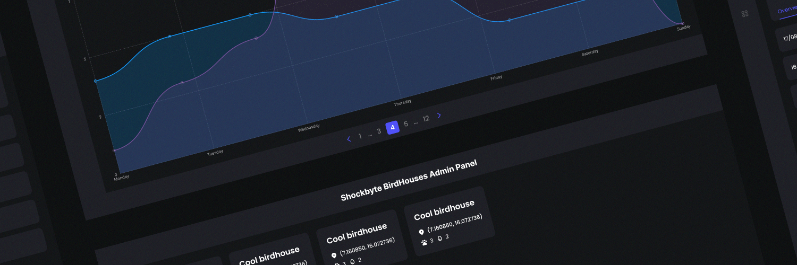

# Birdhouse Frontend (Shockbyte)
> Built using [VueJS](https://vuejs.org/) and [Typescript](https://www.typescriptlang.org/)

Hosted version here [birdhouse-frontend.vercel.app](https://www.birdhouse-frontend.vercel.app/)

## Setup & Routing

I've tried to keep routing as simple and as minimal as possible. I've kept the "Graph" and "Overview" components under the same route as the data will already exist, resulting in less API calls.

```typescript
const routes = [
  {
    path: '/',
    name: 'home',
    component: HomeView
  },
  {
    path: '/houses',
    name: 'houses',
    component: HousesView
  },
  {
    path: '/house/:id',
    name: 'house',
    component: HouseView
  }
];
```

## Data Fetching

Within each view component (HomeView, HousesView & HouseView) I provided a mounted function to trigger a request to the backend API. This data is then stored in state and can be passed down throughout the child components as props.

```typescript
mounted() {
    fetch("https://birdhouse-backend.vercel.app/house")
        .then(res => res.json())
        .then(data => this.houses = data)
        .catch(err => console.log(err)
    );
}
```

## Components

I've created the following components to reuse throughout the web application. Within the Graph component I've utilized [ChartJS](https://www.chartjs.org/) to simplify the data.

 - Sidebar.vue
 - House.vue
 - Header.vue
 - Residency.vue
 - Graph.vue
 - Pagination.vue

## Skeleton Components

As we await the request from the API. I've created copies of some components to act as a skeleton to represent loading data.

 - HouseSkeleton.vue
 - HeaderSkeleton.vue
 - ResidencySkeleton.vue